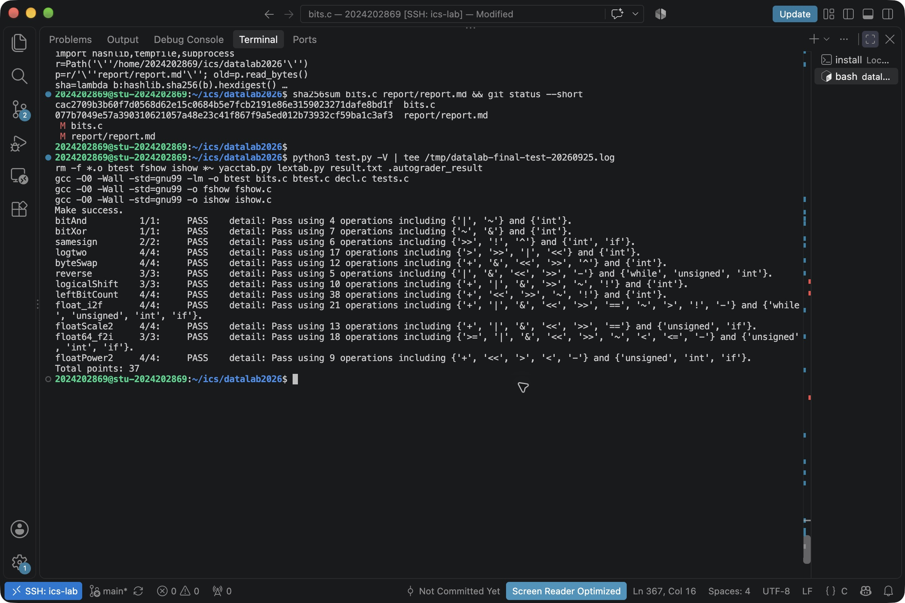

# Datalab 实验报告

姓名：饶羽墨

学号：2024202869

个人仓库：[seekforluv/datalab2026](https://github.com/seekforluv/datalab2026)

## 测试结果

在课程服务器运行 `python3 test.py -V`，12 题全部 PASS，总分 37 / 37。

| 题目 | 得分 | 满分 |
| --- | ---: | ---: |
| bitAnd | 1 | 1 |
| bitXor | 1 | 1 |
| samesign | 2 | 2 |
| logtwo | 4 | 4 |
| byteSwap | 4 | 4 |
| reverse | 3 | 3 |
| logicalShift | 3 | 3 |
| leftBitCount | 4 | 4 |
| float_i2f | 4 | 4 |
| floatScale2 | 4 | 4 |
| float64_f2i | 3 | 3 |
| floatPower2 | 4 | 4 |

图 1　2026 年 9 月 25 日的实际测试结果。

## 解题报告

### bitAnd

参考课程 README 的示例，把 `x`、`y` 分别取反，做或运算后再取反，得到按位与的结果。`notX`、`notY` 保存取反结果，`temp` 保存中间结果。[1]

### bitXor

`both1` 找出两位都是 1 的位置，`both0` 找出两位都是 0 的位置。把这两种情况排除，剩下的就是两位不同的位置，得到异或结果。

### samesign

先处理 0：两个数都为 0 时返回 1，只有一个为 0 时返回 0。非零时看 `x ^ y` 的最高位，同号为 0，异号为 1，再通过右移和 `!` 得到返回值。

### logtwo

结果就是 `v` 最高的 1 的位置，从第 0 位开始计数。代码依次判断能否右移 16、8、4、2 位，最后判断是否还需要计入 1 位，将各段位数合起来。例如 40 的最高位在第 5 位，返回 5。

### byteSwap

`shiftN`、`shiftM` 是两个字节的位置。取出两个字节异或，用 `& 255` 留下低 8 位差异 `diff`。把差异移回两个位置，与 `x` 异或，就能交换字节；位置相同时，差异为 0，结果不变。

`diff + 0u` 让左移使用无符号运算，避免有符号左移超出范围。[4] 结果赋回 `int` 时，按当前 GCC 的转换规则保留 32 位结果。[3]

### reverse

`ans` 初值为 0。循环 32 次，每次取出 `v` 的最低位，把 `ans` 左移一位后接上这一位，再将 `v` 右移。这样最右边的位最先取出，最终移到最左边，完成反转。

### logicalShift

`x >> n` 之后，用掩码清除左边补入的 1。`n > 0` 时，掩码是 `0x7fffffff >> (n-1)`；`n = 0` 时，把掩码设为全 1，并把实际移位量调整为 0，返回原数。

### leftBitCount

`count` 记录最高位开始连续为 1 的位数。按 16、8、4、2、1 位逐段判断，每次用当前 `count` 算出右移位置，确认下一段也是全 1 后增加计数。这五轮最多得到 31，因此 `x = -1` 时再加 1，返回 32。

### float_i2f

`x = 0` 时直接返回 0。其他情况取出符号，用无符号数 `num` 保存大小，这样也能处理最小负整数。移动 `num` 找到最高的 1，确定指数，并取出 23 位尾数 `tail`。

舍去的低 8 位存入 `rest`：大于 128 时进位，小于 128 时不进位；等于 128 时，仅在 `tail` 最低位为 1 时进位，实现取偶数。最后用指数加尾数，保留尾数向指数的进位，再合入符号。

### floatScale2

把输入拆成符号、指数和尾数。指数为 255 时直接返回；指数为 0 时，将尾数左移一位；其余情况将指数加 1。如果加到 255，就清零尾数，得到无穷大。最后合并三部分。

### float64_f2i

从高 32 位 `uf2` 取出符号和指数，减去 1023 得到 `power`。`power < 0` 时返回 0；`power >= 31` 时返回 `0x80000000`，这个值既是越界标志，也对应最小负整数。

其余情况补回尾数隐藏的 1。`power <= 20` 时，高半段右移即可；否则把高半段左移，再从低 32 位 `uf1` 补入需要的位。丢弃小数部分，最后按符号决定是否取负。

### floatPower2

按 `x` 的范围构造结果：小于 -149 时返回 0；从 -149 到 -127 时，在尾数的第 `x+149` 位放 1；从 -126 到 127 时，将 `x+127` 放入指数；大于 127 时返回正无穷大。

## 参考的重要资料

1. [课程 README][1]：实验规则、测试方法和 `bitAnd` 示例。
2. [报告模板通用指南][2]：报告内容与提交格式。
3. [GCC 整数实现说明][3]：负数右移和整数转换。
4. [C11 草案 N1570][4]，6.3.1.3、6.5.7 节：整数转换与移位。

AI 辅助说明：使用 Codex 辅助理解题目、生成和修改代码、运行测试，以及整理报告。

[1]: https://github.com/RUCICS2026/datalab2026/blob/main/README.md
[2]: https://github.com/RUCICS2026/datalab2026/blob/main/report/README.md
[3]: https://gcc.gnu.org/onlinedocs/gcc-11.5.0/gcc/Integers-implementation.html
[4]: https://www.open-std.org/jtc1/sc22/wg14/www/docs/n1570.pdf
